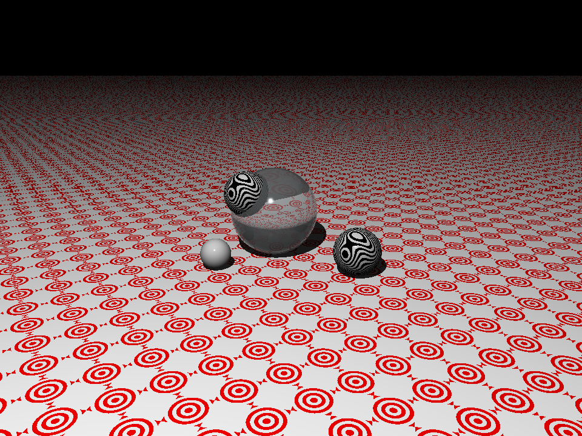

# Ray Tracer

This is my implementation of a ray tracer following along with Jamis Buck's [The Ray Tracer Challenge](https://pragprog.com/titles/jbtracer/the-ray-tracer-challenge/).

## Goal

My goal for this project was just to have some fun and learn about ray tracing. I wanted to avoid analysis paralysis and make progress instead of stressing over code quality and every little design detail. I think this comes through in the roughness of some of the abstractions and inconsistent code cleanliness. Nevertheless, I think it was a good guiding decision that let me focus more on the interesting rendering concepts and linear algebra than on the perfect implementation.

## FAQ

- Why Java?
  - No particular reason; I picked a language and went with it.
- What did you find particularly interesting?
  - Perlin Noise.
    - I enjoyed reviewing Ken Perlin's [implementation in Java](https://mrl.cs.nyu.edu/~perlin/noise/). While not the most readable implementation, I was impressed with the idea of computing the relevant gradient vector from the hash rather than storing them explicitly.
  - Phong Illumination
    - I found it really intuitive actually. And it was fun to see my flat circle transform into a sphere just by adding ambient, diffuse, and specular lighting.
  - Vectors, Matrices, and Coordinate Transformations.
    - Having worked with 3D modeling software in the past, I was aware of the various coordinate systems (model-space, world-space, view-space) but this was my first introduction to the math behind these transformations.
- What did you think of the book?
  - I think the pacing was great. The explanations were clear enough for a project like this. I love the choice to provide test cases and leave the implementation up to the reader. Next up, [PBRT](https://www.pbrt.org)? :)
- What would you do differently next time?
  - I'd likely choose a different language. I felt limited in my ability to create the kind of API I wanted for my matrices and vectors. I'd probably build on top of what I learned and think more critically about the implementation and optimization.
